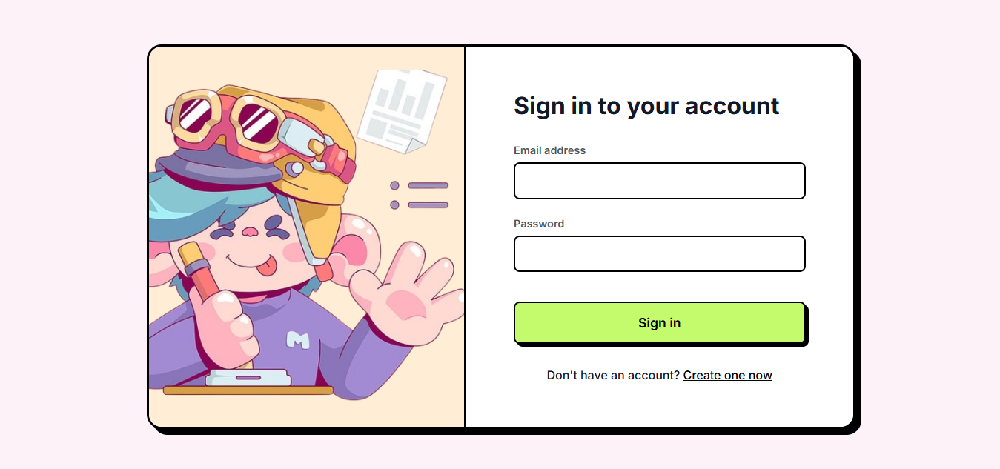
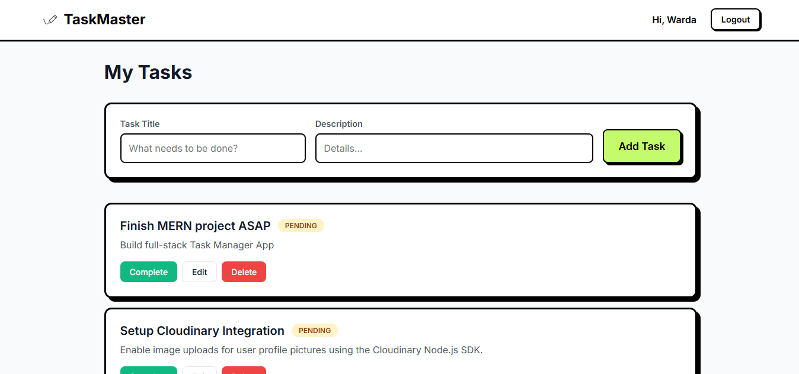

# 🌸 Task Manager App

A **full-stack MERN Task Manager** app where users can register, login, and manage their tasks efficiently.  
Built with **React, Node.js, Express, and MongoDB**, featuring a clean and modern UI.
⭐ If you like this project, consider giving it a star!
---

## 🛠 Tech Stack

**Frontend:** React, Axios, CSS (modern design, glassmorphism hints)  
**Backend:** Node.js, Express, MongoDB, Mongoose, JWT Authentication  
**Other:** Bcryptjs (password hashing), Cors, Dotenv  

---

## ✨ Features

- 🔐 Secure user authentication using JWT  
- 👤 User registration & login system  
- ➕ Create new tasks  
- ✏️ Edit existing tasks  
- ❌ Delete tasks  
- ✅ Mark tasks as completed or pending  
- 📋 Dynamic task dashboard  
- 👋 Personalized navbar with username & logout  
- 🔒 Protected routes (auto redirect if not authenticated)  
---
## 🎯 Demo Flow

1. Register a new user (via API or UI)
2. Login with your credentials
3. Add, edit, and delete tasks
4. Mark tasks as completed
5. Logout securely
---
## 💻 Screenshots

### Login Page


### Dashboard


### Add / Edit Task


### Completed Task


---

## 🚀 Getting Started

1. **Clone the repo**
```bash
git clone https://github.com/YOUR_USERNAME/task-manager.git
```

2. **Backend Setup**
```bash
cd backend
npm install
cp .env.example .env   # create .env with your MongoDB URI and JWT_SECRET
npm start
```

3. **Frontend Setup**
```bash
cd frontend
npm install
npm start
```

4. **Open the app**
Open [http://localhost:3000](http://localhost:3000) in your browser.

---

## 📂 Project Structure

```
task-manager/
├── backend/          # Node.js + Express API
│   ├── config/       # Database connection
│   ├── controllers/  # Request handlers
│   ├── middleware/   # Auth middleware
│   ├── models/       # Mongoose schemas
│   ├── routes/       # API routes
│   ├── server.js     # Express app entry
│   └── .env          # Environment variables
│
├── frontend/         # React frontend
│   ├── src/
│   │   ├── components/  # Reusable UI components
│   │   ├── pages/       # Page components (Login, Dashboard)
│   │   ├── services/    # API service (axios)
│   │   ├── App.js       # Main app component
│   │   └── index.js     # Entry point
│   └── screenshots/     # Screenshots
│
└── README.md
```

---

## 🔐 Environment Variables

Create a `.env` file in the `backend/` directory:

```env
PORT=5000
MONGO_URI=your_mongodb_connection_string
JWT_SECRET=your_secret_key
```

---

## 🤝 Contributing

1. Fork the repository
2. Create a feature branch (`git checkout -b feature/AmazingFeature`)
3. Commit your changes (`git commit -m 'Add some AmazingFeature'`)
4. Push to the branch (`git push origin feature/AmazingFeature`)
5. Open a Pull Request

---

## 📄 License

This project is licensed under the MIT License - see the [LICENSE](LICENSE) file for details.

---
## 🚀 Future Improvements

- 🎨 Advanced UI with glassmorphism & animations  
- 📅 Task scheduling & calendar view  
- 📊 Analytics dashboard  
- 👥 Team collaboration features  
---

## 📞 Contact

Your Name - [wardacodes@gmail.com](mailto:wardacodes@gmail.com)

Project Link: [https://github.com/WardaKhan7/task-manager](https://github.com/WardaKhan7/task-manager)

---

## 🙏 Acknowledgments

- React Community
- Node.js & Express Team
- MongoDB Community
- All open-source contributors

---

## 🌸 Enjoy managing your tasks!    🌸